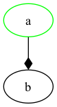
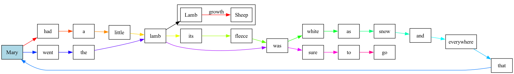
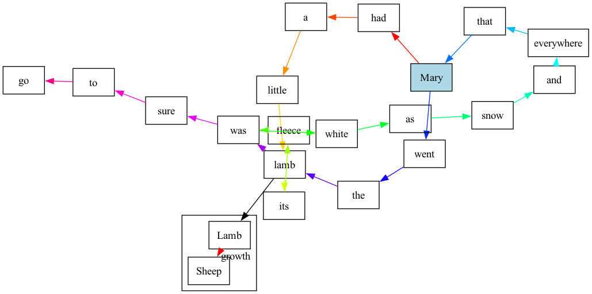

<!-- README.md is generated from README.Rmd. Please edit that file -->

```{r, include = FALSE}
knitr::opts_chunk$set(
  collapse = FALSE,
  comment = "",
  fig.path = "man/figures/README-",
  out.width = "100%"
)

library(minigraphviz)

if (FALSE) {
# Check for functions which do not have an @examples block for roxygen
system("grep -c examples man/*Rd", intern = TRUE) |> 
  grep(":0$", x = _, value = TRUE)
}

if (FALSE) {
  covr::report(covr::package_coverage(
    line_exclusions = list()
  ))
}

if (FALSE) {
  pkgdown::build_site(override = list(destination = "../coolbutuseless.github.io/package/minigraphviz"))
}

# Makevars options to do some deep testing for CRAN

# Type conversions are sane
# PKG_FLAG=-Wconversion

# Pointer overflow checks i.e. dodgy pointer arithmetic
# PKG_CFLAGS+=-fsanitize=pointer-overflow -fsanitize-trap=pointer-overflow
# Then run in the debugger:
# R -d lldb 
# run
# testthat::test_local()

```

# minigraphviz

<!-- badges: start -->

[](https://CRAN.R-project.org/package=minigraphviz)
[](https://github.com/coolbutuseless/minigraphviz-dev/actions/workflows/R-CMD-check.yaml)
<!-- badges: end -->


`{minigraphviz}` is a package for building input files used by [graphiviz](https://graphviz.org) for
visualising graphs (i.e. collections of nodes and edges)

This package is for building documents only.  The rendering from the graph 
specification to an image must currently be done manually - usually with 
the command-line graphviz commands e.g. `dot`, `fdp`, `neato`, etc


## Installation

<!-- This package can be installed from CRAN -->

<!-- ``` r -->
<!-- install.packages('minigraphviz') -->
<!-- ``` -->

You can install the latest development version from
[GitHub](https://github.com/coolbutuseless/minigraphviz) with:

``` r
# install.package('remotes')
remotes::install_github('coolbutuseless/minigraphviz')
```

<!-- Pre-built source/binary versions can also be installed from -->
<!-- [R-universe](https://r-universe.dev) -->

<!-- ``` r -->
<!-- install.packages('minigraphviz', repos = c('https://coolbutuseless.r-universe.dev', 'https://cloud.r-project.org')) -->
<!-- ``` -->

## A simple graph

```{r basic}
library(minigraphviz)

d <- create_graph() |>
  add_node('a', color = 'green') |>
  add_edge('a', 'b', arrowhead = 'diamond')

d
```

#### Rendering with `dot`

```{r}
writeLines(as.character(d), "man/figures/basic.dot")
system("dot -Tpng -O man/figures/basic.dot")
```




## Visualising Lyrics

```{r}
lyrics <- r"(Mary had a little lamb
its fleece was white as snow
and everywhere that Mary went
the lamb was sure to go)"

# Split lyrics into words
lyrics <- gsub("\\(|\\)|,", "", lyrics)
words <- strsplit(lyrics, "\\s+")[[1]]
words <- words[words != ""]
cols <- rainbow(length(words))

# Create the main lyrics graph
d <- create_graph(name = 'mary', rankdir = 'LR') |>
  add_node_attr(shape = 'rect')

# Create edges which link one word with the next
for (i in seq_len(length(words) - 1)) {
  d |> add_edge(words[[i]], words[[i + 1]], color = cols[i])
}

# Create a subgraph
sg <-create_graph(name = 'cluster_sheep') |>
  add_edge('Lamb', 'Sheep', label = 'growth', color = 'red')

# Add the subgraph to the main graph and link two nodes in those graphs
d <- add_subgraph(d, sg) |> 
  add_edge('lamb', 'Lamb')

# Explicitly set some parameters for the 'Mary' node
d <- d |>
  add_node("Mary", style = "filled", fillcolor = 'lightblue')


d
```

#### Rendering with `dot`

```{r}
writeLines(as.character(d), "man/figures/mary.dot")
system("dot -Tpng -O man/figures/mary.dot")
```




#### Alternate rendering with `fdp` instead of `dot`

```{r}
system("fdp -Tpng -oman/figures/mary2.dot.png man/figures/mary.dot")
```




